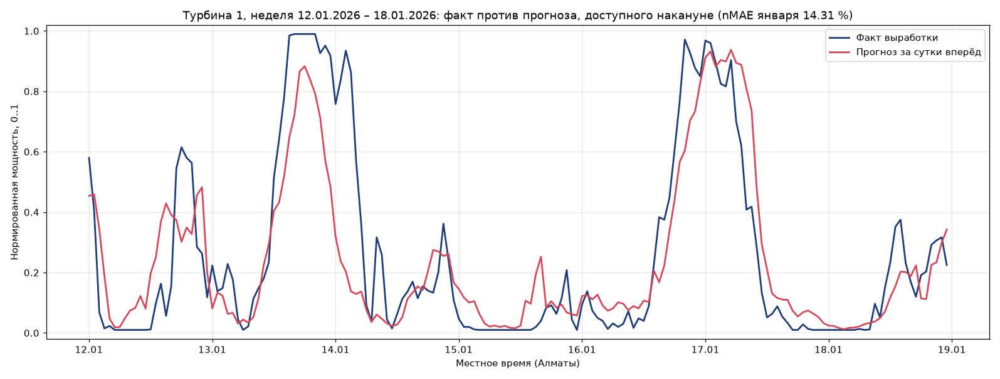
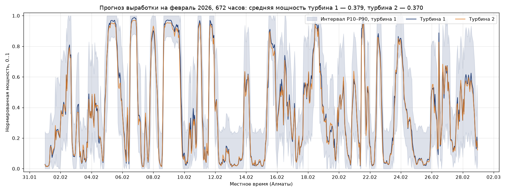

# WindAgent — Agentic AI для прогнозирования выработки ВЭС

[](https://github.com/BAITC-Hacks/hack-c63c1350-technokod/actions/workflows/ci.yml)
[](LICENSE)
[](https://www.python.org/)
[](https://scikit-learn.org/)
[](https://platform.openai.com/)

> Агент, который каждый день сам берёт прогноз погоды, доступный на этот момент, и выпускает почасовой прогноз выработки двух турбин ВЭС на 24–48 часов — с анализом результата и пересчётом при обновлении входных данных.

Команда **Technokod**, HackAlem AI 2026. Трек «Энергетика», кейс Самрук-Казына «Agentic AI для прогнозирования выработки ВЭС».

## Краткое описание

Агент прогнозирует почасовую выработку двух турбин ветроэлектростанции (Шелекский ветровой коридор, Алматинская область) на 24–48 часов вперёд. Для каждой даты выпуска он сам получает архивный прогноз погоды, который был доступен именно в тот момент, готовит признаки, запускает модель, анализирует результат, сравнивает с предыдущим выпуском и пересчитывает прогноз, если входные данные изменились. Пользователь: диспетчер ВЭС или энергосбытовая служба, которой нужен суточный и двухсуточный график выработки для заявок на рынок и планирования резервов.

Ключевое требование кейса — использовать прогноз погоды, доступный на момент прогнозирования, а не факт. Оно выполнено на уровне источника данных: факт погоды не используется ни в тесте, ни в обучении (`docs/validation.md`).

## Что реализовано

- **Инструмент погоды** на Open-Meteo Previous Runs API: для каждого часа берётся значение из прогноза, выпущенного за 1 день (часы 1–24 горизонта) и за 2 дня (часы 25–48) до него. Оба слоя содержат значения из прогонов, выпущенных не позже даты выпуска.
- **Модель выработки** по каждой турбине — смесь трёх компонентов: эмпирическая кривая мощности по прогнозной скорости ветра на 100 м, градиентный бустинг на признаках прогноза и двухэтапная схема (бустинг «признаки прогноза → скорость ветра на гондоле», затем измеренная кривая турбины «ветер гондолы → мощность»). Веса подобраны на честной валидации января 2026. Дополнительно считается интервал P10–P90 по квантилям остатков валидации, разбитым по лиду и уровню прогноза.
- **Агент** с пятью инструментами (`get_weather`, `prepare_and_predict`, `analyze`, `recalculate`, `save_forecast`), класс `ForecastAgent` в `app/agent.py`. Оркестрация через function calling OpenAI (`gpt-5.4-mini` на выбор инструментов, `gpt-5.4` на заключение). Без ключа, в режиме `DEMO_MODE` и при любой ошибке провайдера тот же цикл выполняет детерминированный планировщик, что фиксируется в трассе как `llm_fallback`. Ошибка инструмента возвращается модели как результат вызова, поэтому модель исправляется сама, а не роняет выпуск.
- **Детектор обновления входных данных**: прогноз на пересекающиеся часы сравнивается с выпуском предыдущего дня; при среднем изменении больше 0.15 или при штормовых часах агент выполняет повторный расчёт. Штормовые часы (≥ 22 м/с) обнуляются — буревая защита турбины.
- **Бэктест «как в прошлом»**: 28 последовательных выпусков с 31.01 по 27.02.2026, итоговый почасовой ряд февраля в `outputs/forecast_feb2026.csv`, журнал действий агента по каждому дню в `outputs/agent_logs/`.
- **CLI, HTTP-сервис, тесты, контрольный скрипт** для жюри и кэш всех внешних запросов, позволяющий запускать решение без сети.

## Как работает решение

Цикл одного выпуска (`app/agent.py`):

1. `get_weather(issue_date)` → 48 часов прогноза по координатам ВЭС из архива, доступного на `issue_date`; возвращает диапазон дат, разбивку по лидам, минимум, среднее и максимум ветра и температуры.
2. `prepare_and_predict()` → признаки и прогноз по турбинам 1 и 2, значения 0..1 (нормализованная мощность), интервал P10–P90.
3. `analyze()` → часы штиля (< 3 м/с), часы номинала (≥ 11.5 м/с), штормовые часы (≥ 22 м/с), разброс между турбинами, среднее и максимальное изменение относительно вчерашнего выпуска на пересекающихся часах, флаг `needs_recalculation`.
4. `recalculate(reason)` → повторный опрос источника, пересчёт модели и обнуление штормовых часов; в результате фиксируется `input_changed` — изменились ли входные данные фактически.
5. `save_forecast()` → `outputs/forecasts/<дата>.csv`; журнал `outputs/agent_logs/<дата>.json` с трассой инструментов, анализом и заключением пишется в конце выпуска.

Порядок вызовов выбирает модель. Пример реальной трассы из `outputs/agent_logs_llm/2026-02-15.json`: `get_weather → prepare_and_predict → analyze → prepare_and_predict → recalculate → save_forecast` — агент увидел обновление входных данных и сам инициировал пересчёт. Расход: 5–6 обращений к API и около 4 тыс. prompt-токенов на выпуск.

Бэктест повторяет цикл для каждого дня тестового периода, передавая выпуску дня N результат дня N−1, затем собирает итоговый ряд: на каждый час февраля берётся самый свежий выпуск (lead 1) и отдельно выпуск за двое суток (lead 2).

## Результаты

Честная валидация: обучение до 31.12.2025, проверка на январе 2026 по протоколу «прогноз как в прошлом» (30 выпусков, 720 часов на каждый горизонт). Мощность нормирована на 1, поэтому nMAE — это MAE в процентах от установленной мощности. Числа из `docs/metrics.json`.

| Турбина | Горизонт | MAE | RMSE | nMAE |
|---|---|---|---|---|
| 1 | 24 ч | 0.1431 | 0.2015 | 14.31 % |
| 1 | 48 ч | 0.1633 | 0.2296 | 16.33 % |
| 2 | 24 ч | 0.1455 | 0.2041 | 14.55 % |
| 2 | 48 ч | 0.1666 | 0.2316 | 16.66 % |

Вклад компонентов на горизонте 24 ч (MAE, турбина 1 / турбина 2): кривая мощности 0.1471 / 0.1480, двухэтапная схема 0.1493 / 0.1526, градиентный бустинг «в лоб» 0.1580 / 0.1608, смесь 0.1431 / 0.1455. Подбор весов на валидации дал бустингу нулевой вес на обеих турбинах (турбина 1 — `two_stage` 0.5 и `curve` 0.5, турбина 2 — `two_stage` 0.4 и `curve` 0.6): прямое предсказание мощности проигрывает обоим физически осмысленным компонентам, а выигрыш даёт именно их усреднение. Объём обучения итоговых моделей — 31 078 и 33 710 часов.

Сравнение с эталонами (январь 2026, горизонт 24 ч, MAE, расчёт в `docs/validation.md`):

| Метод | Турбина 1 | Турбина 2 |
|---|---|---|
| Модель | 0.1431 | 0.1455 |
| Климатология по часу суток | 0.3003 | 0.3007 |
| Константа (среднее по истории) | 0.3010 | 0.3017 |
| Персистентность (последние полные сутки) | 0.3568 | 0.3463 |

Модель точнее персистентности на 58–60 % и климатологии на 52 %. Персистентность здесь хуже константы — это объясняет, почему лаги фактической выработки в признаки не вошли.

Интервал P10–P90 на январе покрывает 79.6 % фактических значений. Оговорка: квантили остатков подобраны на том же месяце, поэтому оценка покрытия оптимистична по построению; независимая оценка приведена в `docs/validation.md`.

Проверка на утечку факта: прогнозная скорость ветра на 100 м против факта с гондолы за январь 2026 — корреляция 0.741, MAE 1.91 м/с, смещение −0.93 м/с. Это обычный суточный прогноз, а не переодетый факт. Подстановка фактического ветра в измеренную кривую турбины даёт MAE 0.032, то есть 78 % нынешней ошибки создаёт сам прогноз погоды и только 22 % — модель турбины.




## Технологии

Python 3.14 (эталонное окружение, на нём выполнены все замеры; в `Dockerfile` указан python:3.11-slim, но Docker на машине сборки не устанавливался, поэтому контейнерный путь не проверялся), pandas, scikit-learn (HistGradientBoosting), httpx, OpenAI SDK, FastAPI, matplotlib, pytest, Docker. Внешние сервисы: Open-Meteo Previous Runs API и Historical Forecast API (открытые, без ключа), OpenAI API. Резервный провайдер LLM — NVIDIA NIM через совместимый с OpenAI эндпоинт, переключается переменной `LLM_PROVIDER=nvidia`; вживую этот путь не проверялся, ключа NVIDIA у команды не было.

## Архитектура

```
data/raw/*.csv ──► app/data.py (часовая агрегация)
                                        │
Open-Meteo ──► app/weather.py (архив прогнозов, кэш) ──► app/features.py ──► app/model.py
                                        │                    (кривая + GBM + двухэтапная схема, P10–P90)
                                        │                                          │
                              app/agent.py: get_weather → prepare_and_predict → analyze → [recalculate] → save_forecast
                                        │           оркестратор: LLM function calling или детерминированный план
                              app/backtest.py (28 выпусков) ──► outputs/forecast_feb2026.csv, outputs/agent_logs/
                                        │
                              app/cli.py (train | forecast | backtest | report), app/serve.py (HTTP)
```

Подробнее: `docs/architecture.md`, устройство агентного контура — `docs/agent-design.md`, решения с обоснованием — `docs/adr/`.

## Установка

```bash
git clone https://github.com/BAITC-Hacks/hack-c63c1350-technokod.git
cd hack-c63c1350-technokod
python -m venv .venv
# Windows: .venv\Scripts\activate      Linux/macOS: source .venv/bin/activate
pip install -r requirements.txt
cp .env.example .env        # Windows: copy .env.example .env
python scripts/check_env.py
```

Переменные окружения (`.env`): `LLM_PROVIDER` (`openai` | `nvidia` | `demo`), `OPENAI_API_KEY`, `OPENAI_MODEL`, `OPENAI_REASONING_MODEL`, `NVIDIA_API_KEY`, `NVIDIA_MODEL`, `DEMO_MODE`. **Для полного контрольного сценария ключи не нужны**: числовой прогноз считает обученная модель, а LLM отвечает только за порядок вызова инструментов и текст заключения.

Docker (`.env` должен существовать, его требует `docker-compose.yml`; этот путь не проверялся — Docker на машине сборки не устанавливался):
```bash
docker compose run --rm app bash scripts/demo.sh   # контрольный сценарий целиком, включая обучение
docker compose up                                  # HTTP-сервис на порту 8000
```
В `docker-compose.yml` смонтирована только `./data`, поэтому обученные модели и результаты остаются внутри контейнера и между отдельными запусками не сохраняются. Готовый блок `volumes` для `models/` и `outputs/` приведён в `docs/runbook.md`.

## Запуск

```bash
python -m app.cli check                        # проверка окружения, данных, моделей, кэша
python -m app.cli train                        # обучение моделей, около 4 минут, создаёт models/
python -m app.cli forecast --date 2026-01-31   # выпуск агентом (с LLM, если задан ключ)
python -m app.cli forecast --date 2026-01-31 --no-llm
python -m app.cli backtest --no-llm            # все выпуски 31.01–27.02.2026
python -m app.cli report                       # сводка по метрикам и артефактам
python -m app.cli fetch-weather --start 2026-01-31 --end 2026-02-27   # прогрев кэша
```

HTTP-сервис (`python -m app.serve`, порт из `APP_PORT`): `GET /health`, `GET /forecast/{issue_date}?horizon=48&llm=false`, `GET /submission`.

## Как проверить решение

Полный контрольный сценарий одной командой: `bash scripts/demo.sh` (Linux/macOS/Git Bash) или `powershell scripts/demo.ps1` (Windows). Скрипт сам выбирает интерпретатор (`PYTHON`, затем `.venv`, затем `python` из PATH), останавливается на первой ошибке и выполняет семь шагов: проверка окружения → обучение (пропускается, если модели уже есть) → выпуск прогноза → бэктест февраля → сводка → автотесты → живая LLM-оркестрация (пропускается, если ключ не задан). Замерено: 20 секунд на обученных моделях, около 4 минут на свежем клоне вместе с обучением. Сеть не требуется: архивные прогнозы лежат в `data/cache/weather/` (69 файлов, 4.9 МБ).

На свежем клоне первый прогон занимает около 5 минут, из них примерно 4 минуты — обучение: файлы `models/*.joblib` не коммитятся, потому что pickle привязан к версии scikit-learn и на другой машине не загрузится. Если модели уже обучены, шаг 2 пропускается и сценарий проходит примерно за минуту.

Ожидаемый результат:

- `python -m app.cli train` печатает по каждой турбине веса смеси и ошибку на январе 2026: nMAE 14.31 % и 14.55 % на горизонте 24 ч, 16.33 % и 16.66 % на 48 ч (`docs/metrics.json`).
- `python -m app.cli forecast --date 2026-01-31 --no-llm` печатает трассу `get_weather → prepare_and_predict → analyze → save_forecast`, анализ и заключение; появляется `outputs/forecasts/2026-01-31.csv` на 96 строк (48 часов × 2 турбины, 13 колонок).
- `python -m app.cli backtest --no-llm` создаёт 28 файлов выпусков, `outputs/forecast_all_issues.csv` на 2 688 строк, `outputs/forecast_feb2026.csv` на 672 часа и `outputs/backtest_summary.csv` на 28 строк. Агент выполнил повторный расчёт в четыре дня: 06.02, 15.02, 21.02, 24.02.
- `python -m pytest -q tests` → 6 тестов проходят.

Проверка LLM-оркестрации: задать `OPENAI_API_KEY` в `.env` и выполнить `python -m app.cli forecast --date 2026-02-15`. Порядок вызова инструментов выбирает модель, заключение пишет она же. Результаты трёх таких выпусков сохранены в репозитории: `outputs/agent_logs_llm/2026-02-05.json`, `outputs/agent_logs_llm/2026-02-15.json`, `outputs/agent_logs_llm/2026-02-21.json` — в двух из них модель самостоятельно приняла решение о пересчёте. При ошибке сети или ключа агент откатывается на детерминированный план, это фиксируется в трассе как `llm_fallback`.

Проверка честности прогноза (ключевое требование кейса) описана отдельным разделом в `docs/test-plan.md`, численное доказательство — в `docs/validation.md`.

## Выходные файлы

| Файл | Содержание |
|---|---|
| `outputs/forecast_feb2026.csv` | Итоговый почасовой ряд февраля 2026, 672 строки: `ts`, `turbine_1_lead1`, `turbine_2_lead1`, `turbine_1_lead2`, `turbine_2_lead2`, `turbine_1_p10`, `turbine_2_p10`, `turbine_1_p90`, `turbine_2_p90`, `farm_mean_lead1` |
| `outputs/forecast_all_issues.csv` | Все 28 выпусков по часам, 2 688 строк: `issue_date`, `ts`, `horizon_hour` (1–48), `lead_day`, `turbine`, `power_norm_pred`, `power_gbm_pred`, `power_curve_pred`, `power_p10`, `power_p90`, `power_two_stage_pred`, `wind_speed_100m`, `wind_nacelle_pred` |
| `outputs/backtest_summary.csv` | Сводка по выпускам, 28 строк: часы, отметки пересчёта и режима LLM, часы штиля, номинала и шторма, средний КИУМ по турбинам, изменение относительно прошлого выпуска |
| `outputs/forecasts/<дата>.csv` | Отдельный выпуск, 96 строк |
| `outputs/agent_logs/<дата>.json` | Журнал выпуска: `issue_date`, `llm_used`, `recalculated`, `analysis`, `conclusion`, `trace` |
| `outputs/agent_logs_llm/<дата>.json` | Журналы трёх выпусков с живой LLM-оркестрацией |

Значения — нормализованная мощность 0..1, как в исходных данных; время местное (Алматы). Для 1 февраля колонки `*_lead2` пусты: прогноз за двое суток потребовал бы выпуска от 30 января, который вне тестового периода. Перевод в МВт·ч описан в `docs/user-guide.md`.

## Документация

| Документ | О чём |
|---|---|
| `docs/architecture.md` | Архитектура, контракты данных, масштабирование |
| `docs/agent-design.md` | Агентный контур: инструменты, промпт, пороги, журнал, бюджет LLM |
| `docs/adr/` | Восемь архитектурных решений с обоснованием и последствиями |
| `docs/model-card.md` | Карточка модели: данные, признаки, метрики, ограничения |
| `docs/validation.md` | Протокол честной валидации, доказательство отсутствия утечки, эталоны |
| `docs/data-quality.md` | Качество исходных данных: разрывы, выбросы, кривая мощности |
| `docs/analysis.md` | Разбор ТЗ и первичный анализ данных |
| `docs/metrics.md`, `docs/metrics.json` | Метрики в читаемом виде и машинном формате |
| `docs/business-value.md` | Ценность для эксплуатирующей организации, расчёт эффекта |
| `docs/pitch.md` | Сценарий защиты и ответы на вопросы |
| `docs/user-guide.md` | Руководство пользователя: установка, команды, разбор выходных файлов |
| `docs/runbook.md` | Регламент эксплуатации, мониторинг, реакции на отказы |
| `docs/test-plan.md` | Программа и методика испытаний с критериями приёмки |
| `docs/compliance.md` | Соответствие Положению: хронология коммитов, лицензии, раскрытие ИИ |
| `docs/index.md` | Карта документации и маршруты чтения |

## Данные и интеграции

- `data/raw/turbine_1.csv`, `data/raw/turbine_2.csv` — данные организаторов, 10-минутные записи 11.03.2023–31.01.2026 (скорость ветра с гондолы, нормализованная мощность, температура). Разбор в `docs/analysis.md` и `docs/data-quality.md`.
- Open-Meteo Previous Runs API (`previous-runs-api.open-meteo.com`) — архивные прогнозы, покрытие с 16.02.2024. Обучение и тест идут на них.
- Open-Meteo Historical Forecast API — использовался при разведке данных, в итоговую модель не входит.
- OpenAI API — оркестрация агента и заключения. Ключи только через переменные окружения, `.env` в `.gitignore`.
- `data/cache/weather/` — кэш архивных прогнозов, закоммичен ради запуска без сети.

Часовые пояса: данные ВЭС в местном времени, погода запрашивается с `timezone=Asia/Almaty`, стыковка по локальному часу (переход Казахстана на UTC+5 в марте 2024 учитывается источником погоды).

## Стороннее и подготовленное до старта

Раскрытие по п. 5.4.4, 5.4.4.2 и 5.4.12 Положения, подробная хронология — в `docs/compliance.md`.

Коммиты `f992796` и `573e6b8` (13:24 по времени Астаны) содержат инфраструктурную заготовку, подготовленную до начала хакатона: структура папок, `.gitignore`, `.env.example`, `requirements.txt`, `Dockerfile`, `docker-compose.yml`, `app/config.py`, `app/llm.py` (обёртка над OpenAI SDK), `scripts/check_env.py`, `tests/test_smoke.py`. Зафиксировать её раньше было физически нельзя: репозиторий команды выдан после старта. Логики кейса в заготовке нет, это проверяется командой `git show f992796`.

Вся предметная логика — загрузка и агрегация данных ВЭС, инструмент архивных прогнозов, признаки, модель, агент, бэктест, CLI, сервис — написана после старта, начиная с коммита `b2b3b5b`, и прослеживается по истории.

Open-source: библиотеки из `requirements.txt` (BSD, MIT, Apache-2.0; перечень с лицензиями в `docs/compliance.md`). Данные: организаторов и Open-Meteo (CC BY 4.0). Разработка велась с применением ИИ-агентов для генерации и анализа кода (п. 5.4.12 Положения); архитектурные решения, выбор источника данных и протокол валидации приняты командой, результаты проверены автотестами и численными экспериментами.

## Ограничения

- Архив Previous Runs начинается с 16.02.2024, поэтому обучение идёт на 23 месяцах, а не на всей истории с марта 2023 года.
- Факт выработки за февраль 2026 участникам не выдан, поэтому качество на тесте не измерялось. Все приведённые метрики относятся к январю 2026 и получены по тому же протоколу «прогноз как в прошлом».
- Потолок точности задаёт сам прогноз погоды: на идеальном ветре ошибка модели турбины составляет 0.032 MAE против нынешних 0.143. Дальнейший выигрыш даст ансамбль метеомоделей или коммерческий источник прогноза, а не усложнение модели турбины.
- Кривая мощности не учитывает плановые остановы и ограничения по команде диспетчера: в выданных данных нет журнала простоев. При внедрении нужны события SCADA.
- Интервал P10–P90 построен на остатках января 2026 и подобран на том же месяце, на котором измерено покрытие; на новых данных интервал требует перекалибровки.
- В бэктесте по архиву повторный опрос источника возвращает тот же срез (у архива суточная гранулярность), поэтому пересчёт меняет результат только через буревую защиту. В промышленной эксплуатации агент должен запускаться при каждом новом выпуске прогноза погоды, 4 раза в сутки; вызова оперативного API в коде нет.
- Путь NVIDIA NIM реализован переключением провайдера, но вживую не проверялся.
- LLM-оркестрация зависит от внешнего API и лимитов, поэтому предусмотрен откат на детерминированный план; числовой результат от режима не зависит.

## Развёрнутая версия

Нет. Запуск из репозитория по инструкции выше, либо HTTP-сервис в Docker (`docker compose up`).
