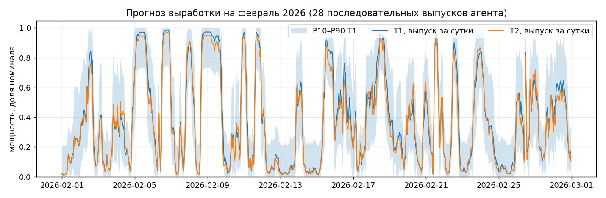

# WindAgent — Agentic AI для прогнозирования выработки ВЭС

Команда **Technokod**, HackAlem AI 2026. Трек «Энергетика», кейс Самрук-Казына «Agentic AI для прогнозирования выработки ВЭС».

## Краткое описание

Агент прогнозирует почасовую выработку двух турбин ветроэлектростанции (Шелекский ветровой коридор, Алматинская область) на 24–48 часов вперёд. Для каждой даты выпуска он сам получает архивный прогноз погоды, который был доступен именно в тот момент, готовит признаки, запускает модель, анализирует результат, сравнивает с предыдущим выпуском и пересчитывает прогноз, если входные данные изменились. Пользователь: диспетчер ВЭС или энергосбытовая служба, которой нужен суточный и двухсуточный график выработки для заявок на рынок и планирования резервов.

## Что реализовано

- Инструмент погоды на Open-Meteo Previous Runs API: для каждого часа берётся значение из прогноза, выпущенного за 1 день (часы 1–24 горизонта) и за 2 дня (часы 25–48) до него. Факт погоды не используется нигде, ни в тесте, ни в обучении.
- Модель выработки по каждой турбине из трёх компонентов: кривая мощности по прогнозному ветру на 100 м, GBM признаки прогноза → мощность, двухэтапная модель GBM признаки прогноза → скорость ветра на гондоле → измеренная кривая мощности турбины. Веса смеси подбираются на честной валидации (`docs/metrics.md`).
- Агент с пятью инструментами (`get_weather`, `prepare_and_predict`, `analyze`, `recalculate`, `save_forecast`). Оркестрация через function calling OpenAI (резерв NVIDIA NIM). Без ключа или в режиме проверки тот же цикл выполняет детерминированный планировщик.
- Детектор обновления входных данных: прогноз на пересекающиеся часы сравнивается с выпуском предыдущего дня, при значимом расхождении или штормовых часах запускается повторный расчёт.
- Интервал неопределённости P10–P90 на каждый час из квантилей остатков честной валидации (покрытие на январе 80%), для планирования резервов.
- Бэктест «как в прошлом»: 28 последовательных выпусков с 31.01 по 27.02.2026, итоговый почасовой ряд за февраль в `outputs/forecast_feb2026.csv`, журнал действий агента по каждому дню в `outputs/agent_logs/`.
- CLI, тесты, контрольный скрипт для жюри, кэш всех внешних запросов для запуска без сети.

## Как работает решение

1. `get_weather(issue_date)` → 48 часов прогноза по координатам ВЭС из архива, доступного на `issue_date`.
2. `prepare_and_predict` → признаки, предсказание по турбине 1 и 2, значения 0..1 (нормализованная мощность).
3. `analyze` → часы штиля (< 3 м/с), часы номинала (≥ 11.5 м/с), штормовые часы (≥ 22 м/с), разброс между турбинами, среднее изменение относительно вчерашнего выпуска на пересекающихся часах.
4. `recalculate` → при штормовых часах или изменении входных данных больше 0.15 повторно берётся погода и пересчитывается прогноз, штормовые часы обнуляются (отключение турбины).
5. `save_forecast` → `outputs/forecasts/<дата>.csv` и журнал `outputs/agent_logs/<дата>.json` с трассой инструментов и заключением.
6. Бэктест повторяет шаги 1–5 для каждого дня теста, затем собирает итоговый ряд: для каждого часа февраля берётся самый свежий выпуск (lead 1) и отдельно выпуск за двое суток (lead 2).




## Технологии

Python 3.10+, pandas, scikit-learn (HistGradientBoosting), httpx, OpenAI SDK (OpenAI API и NVIDIA NIM через совместимый эндпоинт), Open-Meteo Previous Runs API и Historical Forecast API (открытые, без ключа), pytest, Docker.

## Архитектура

```
data/raw/*.csv ──► app/data.py (часовая агрегация)
                                        │
Open-Meteo ──► app/weather.py (архив прогнозов, кэш) ──► app/features.py ──► app/model.py (кривая + GBM)
                                        │                                          │
                              app/agent.py: get_weather → prepare_and_predict → analyze → [recalculate] → save_forecast
                                        │           оркестратор: LLM function calling или детерминированный план
                              app/backtest.py (28 выпусков) ──► outputs/forecast_feb2026.csv, outputs/agent_logs/
                                        │
                              app/cli.py: train | forecast | backtest | report
```

## Установка

```bash
git clone https://github.com/BAITC-Hacks/hack-c63c1350-technokod.git
cd hack-c63c1350-technokod
python -m venv .venv
# Windows: .venv\Scripts\activate      Linux/macOS: source .venv/bin/activate
pip install -r requirements.txt
cp .env.example .env        # Windows: copy .env.example .env
python scripts/check_env.py
```

Переменные окружения (`.env`): `LLM_PROVIDER` (`openai` | `nvidia` | `demo`), `OPENAI_API_KEY`, `OPENAI_MODEL`, `NVIDIA_API_KEY`, `NVIDIA_MODEL`, `DEMO_MODE`. Для полного контрольного сценария ключи не нужны.

Docker:
```bash
docker compose run --rm app bash scripts/demo.sh
```

## Запуск

```bash
python -m app.cli train                        # обучение моделей, ~30 секунд, создаёт models/
python -m app.cli forecast --date 2026-01-31   # прогноз агентом на одну дату (с LLM, если задан ключ)
python -m app.cli forecast --date 2026-01-31 --no-llm
python -m app.cli backtest --no-llm            # все выпуски 31.01–27.02.2026
python -m app.cli report                       # сводка
```

## Как проверить решение

Полный контрольный сценарий одной командой: `bash scripts/demo.sh` (Linux/macOS) или `powershell scripts/demo.ps1` (Windows). Занимает около двух минут, сеть не требуется: архивные прогнозы лежат в `data/cache/weather/`.

Ожидаемый результат:
- `python -m app.cli train` печатает для каждой турбины вес смеси и ошибку на январе 2026: nMAE 14.1–14.6% на горизонте 24 ч и 16.2–16.7% на 48 ч (`docs/metrics.json`).
- `python -m app.cli forecast --date 2026-01-31 --no-llm` печатает трассу инструментов `get_weather → prepare_and_predict → analyze → save_forecast`, анализ и заключение; появляется `outputs/forecasts/2026-01-31.csv` на 96 строк (48 часов × 2 турбины).
- `python -m app.cli backtest --no-llm` создаёт 28 файлов выпусков, `outputs/forecast_feb2026.csv` на 672 часа и `outputs/backtest_summary.csv`, где видно, в какие дни агент делал пересчёт (в текущем прогоне 4 дня).
- `python -m pytest -q tests` → 6 тестов проходят.

Проверка LLM-оркестрации: задать `OPENAI_API_KEY` в `.env` и выполнить `python -m app.cli forecast --date 2026-02-06`. В журнале `outputs/agent_logs/2026-02-06.json` появится заключение, написанное моделью, порядок вызова инструментов выбирает модель. При ошибке сети или ключа агент откатывается на детерминированный план, это фиксируется в трассе как `llm_fallback`.

Формат итогового файла `outputs/forecast_feb2026.csv`: `ts` (местное время Астаны), `turbine_1_lead1`, `turbine_2_lead1` (прогноз, выпущенный за сутки), `turbine_1_lead2`, `turbine_2_lead2` (за двое суток), `turbine_*_p10`, `turbine_*_p90` (интервал для выпуска за сутки), `farm_mean_lead1`. Значения 0..1, как в исходных данных. Полная таблица всех выпусков: `outputs/forecast_all_issues.csv` (issue_date, ts, horizon_hour, lead_day, turbine, прогноз смеси, GBM и кривой отдельно).

## Данные и интеграции

- `data/raw/turbine_1.csv`, `data/raw/turbine_2.csv` — данные организаторов, 10-минутные записи 11.03.2023–31.01.2026 (скорость ветра, нормализованная мощность, температура). Разбор в `docs/analysis.md`.
- Open-Meteo Previous Runs API (`previous-runs-api.open-meteo.com`) — архивные прогнозы, покрытие с 16.02.2024. Обучение и тест на них.
- Open-Meteo Historical Forecast API — использовался при разведке данных, в итоговую модель не входит.
- OpenAI API, NVIDIA NIM API — оркестрация агента и заключения. Ключи только через переменные окружения.

Часовые пояса: данные ВЭС в местном времени, погода запрашивается с `timezone=Asia/Almaty`, стыковка по локальному часу (переход Казахстана на UTC+5 в марте 2024 учитывается источником погоды).

## Стороннее и подготовленное до старта

Раскрытие по п. 5.4.4 и 5.4.4.2 Положения. До 13:00 23.09.2026 в репозиторий добавлены только инфраструктурные заготовки без логики кейса: структура папок, `.gitignore`, `.env.example`, `requirements.txt`, `Dockerfile`, `docker-compose.yml`, `app/config.py`, `app/llm.py` (обёртка над OpenAI SDK с переключением провайдера и кэшем ответов), `scripts/check_env.py`, `tests/test_smoke.py`. Вся логика кейса (`app/data.py`, `app/weather.py`, `app/features.py`, `app/model.py`, `app/agent.py`, `app/backtest.py`, `app/cli.py`, `scripts/train.py`) написана после старта, история в коммитах.

Open-source: библиотеки из `requirements.txt`. Данные: организаторов и Open-Meteo (CC BY 4.0). Инструменты разработки: AI-агенты для генерации и анализа кода (п. 5.4.12 Положения).

## Ограничения

- Архив Previous Runs начинается с 16.02.2024, обучение идёт на 23 месяцах, а не на всей истории с 2023 года.
- Факт за февраль 2026 участникам не выдан, поэтому качество на тесте не измерялось. Метрики приведены по январю 2026 в том же протоколе «прогноз как в прошлом».
- Кривая мощности не учитывает плановые остановы и ограничения по команде диспетчера, для них нужны журналы ВЭС.
- Пересчёт при обновлении данных в бэктесте срабатывает на изменение между выпусками; в промышленной эксплуатации он должен запускаться по расписанию при каждом новом выпуске прогноза погоды (4 раза в сутки).
- LLM-оркестрация зависит от внешнего API и лимитов, поэтому предусмотрен откат на детерминированный план.

## Развёрнутая версия

Нет. Запуск из репозитория по инструкции выше.
